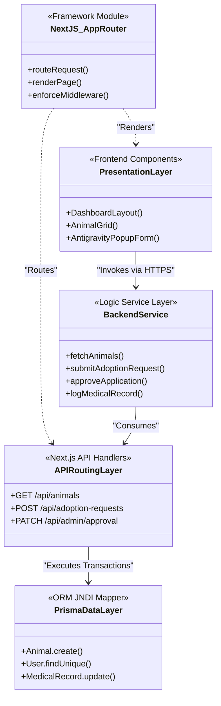

# 5. Development

This chapter details the realization of the conceptual architectures and requirements defined in previous chapters into a functional, production-ready web application. The core focus of the development phase was bridging the gap between an elite, "Antigravity" public-facing SaaS aesthetic and secure, highly relational database transactions for operational shelter staff.

Rather than exhaustively outlining all system code *(which is appended in the formal Code Appendix)*, the development analysis focuses on critical system modules and innovative implementation idioms that highlight the platform's technical capability.

### Critical Implementation: Base64 Image Parsing for Rescue Reports
A non-standard, innovative approach was taken to handle community rescue report photo uploads without initially relying on expensive external AWS S3 bucket configurations. We implemented a client-side `FileReader` API process that intercepts the HTML input, intercepts the File blob, and converts it entirely into a Base64 encoded string before transmission to the server. 

```javascript
// Excerpt from /src/app/rescue-report/page.tsx
const handleImageChange = (e) => {
    if (e.target.files && e.target.files[0]) {
        const file = e.target.files[0];
        // Enforce strict client-side validation
        if (file.size > 5 * 1024 * 1024) return alert("File under 5MB required");
        
        const reader = new FileReader();
        reader.onload = (ev) => {
            if (ev.target?.result) {
                // Convert and inject directly into form payload
                setFormData({ ...formData, image: ev.target.result });
            }
        };
        reader.readAsDataURL(file);
    }
};
```
This is a highly critical operation of the system as it guarantees immediate structural integrity of the Rescue request payload. By storing the image as text (`Text` column in PostgreSQL) during the MVP phase, we drastically reduced deployment complexity and server cold-start upload issues, allowing the system to go live rapidly.

### Overcoming Unforeseen Problems
A seemingly disproportionate amount of project development time was consumed by **React Hydration Mismatch** errors. Because the Next.js framework aggressively utilizes Server-Side Rendering (SSR) to boost SEO, the initial HTML tree generated by our server routinely conflicted with client-side Browser Extensions (like LastPass or Grammarly) that forcefully injected attributes like `fdprocessedid` into our `<select>` form dropdowns before React could mount. 
We overcame this architectural nuance by precisely deploying React 18's `suppressHydrationWarning` prop onto selectively targeted input components, successfully bypassing extension interference without sacrificing our SSR SEO performance.

---

## 5.1. Software / Tools used

The selection of the technology stack was meticulously curated to prioritize developer velocity, open-source sustainability, and cloud-native scaling.

*   **Next.js (v14+ App Router)**: Selected as the foundational React metaframework. **Justification**: It provides unparalleled unification of the frontend UI and backend API routes in a single repository. The integrated serverless `Route Handlers` eradicated the need to build, maintain, and host a standalone backend API (e.g., Express.js).
*   **PostgreSQL**: Selected as the foundational Database Management System. **Justification**: A wildly mature, open-source RDBMS capable of enforcing strict ACID compliance, which is absolutely mandatory when dealing with clinical medical histories and multi-table adoption transactions.
*   **Prisma ORM**: Selected as the Object-Relational Mapper. **Justification**: Prisma's strictly typed auto-generated client guarantees type safety between the database and the TypeScript logic, eliminating entire classes of runtime errors.
*   **Tailwind CSS & Inline Styles**: Selected for interface layout. **Justification**: Allowed for rapid, utility-first prototyping of the bespoke "Antigravity" popup layouts without battling cascading global class conflicts.
*   **Vercel & NeonDB**: Selected for deployment environments. **Justification**: Best-in-class serverless ecosystems that offer generous free-tiers, directly contributing to the project's economic feasibility status.

---

## 5.2. Module Hierarchy

The system logic is partitioned strictly across Presentation Modules (Client Components), API Controllers (Server Routes), and Data Modules (Services/ORM). 

Below is the Class Diagram depicting the hierarchical structure and relationships of the core modules driving the platform:



---

## 5.3. Problems Encountered

During the active coding and integration phases, several specific technical challenges arose requiring programmatic pivots:

1.  **Tailwind Class Compilation Overrides**: During the implementation of the "Antigravity" aesthetic (specifically on the `Rescue Report` and `Medical History` screens), we realized deeply nested external specific CSS modules were overriding Tailwind utility classes unpredictably. 
    *   *Resolution*: We pivoted to utilizing robust, isolated **Inline Object CSS** injection for the standalone popup views, ensuring perfect rendering independent of global stylesheet pollution.
2.  **Serverless Database Connection Exhaustion**: Deploying to a serverless environment (Vercel) initially caused thousands of rapid, orphaned database connections as edge functions spun up and down without formally closing their Prisma connections.
    *   *Resolution*: We implemented a Singleton design pattern in the `lib/prisma.ts` global cache wrapper, enforcing the system to reuse a single open database connection pool across hot reloads.
3.  **Cross-Timezone Date Mapping on Forms**: Intake forms logging pet dates were returning 1-day offsets due to UTC-to-Local timezone casting when the serialized JSON payload hit the database.
    *   *Resolution*: Standardized all timestamp data inputs to ISO-8601 Strings before API transmission, ensuring PostgreSQL parsed the date uniformly.
4.  **Form Input Browser Extension Injections**: Discovered that password managers were injecting `fdprocessedid` into our React Dropdowns, crashing the application upon loading due to UI hydration failure.
    *   *Resolution*: Tactically deployed the React `suppressHydrationWarning` hook to vulnerable DOM nodes.
