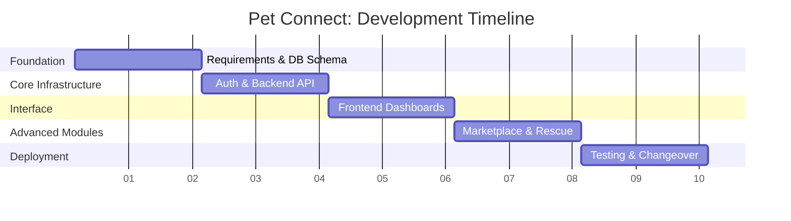
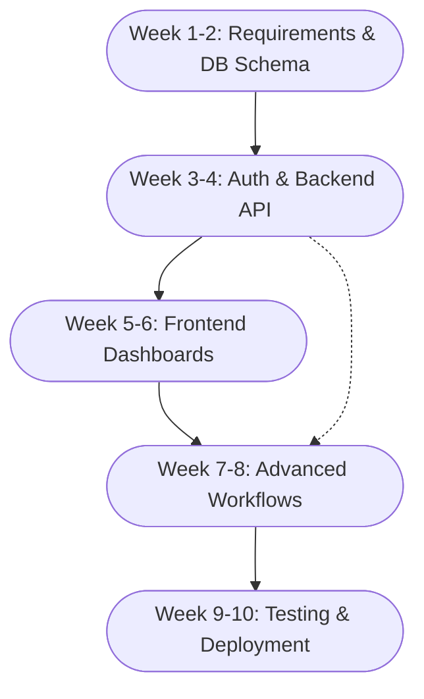

# 3. Requirement Analysis and Specification

## 3.1. Requirement Analysis
Requirement analysis is the crucial phase in software design where the needs and constraints of end-users are systematically collected, analyzed, and documented to serve as the blueprint for development. For the Pet Connect platform, requirements were identified through a combination of extensive literary research into shelter management inefficiencies and direct comparative analysis of existing legacy software tools used by non-profit organizations. Key stakeholder needs—comprising administrative staff, veterinarians, and prospective community adopters—were mapped out to define distinct functional workflows, ensuring the system bridges the gap between internal data management and public-facing engagement.

## 3.2. Existing System
The existing system for many animal shelters relies heavily on manual, paper-based workflows or disparate, fragmented digital tools such as standalone spreadsheets. Data fragmentation is rampant, as medical histories are often stored in physical cabinets while adoption requests are processed via unorganized email threads. Furthermore, without a dedicated public platform, animals heavily rely on fleeting social media posts for visibility, which lacks searchability, real-time status updates, and dynamic community engagement features like reporting lost pets with instant evidence.

## 3.3. Proposed System
While some enterprise-level shelter management software exists (e.g., Shelterluv or PetPoint), they are often prohibitively expensive, overly complex, and heavily corporate-focused, ignoring the need for a modern, engaging public interface. The proposed system, Pet Connect, is a tailored, cloud-based platform that unifies public browsing, adoption workflows, clinical medical logging, community rescue reporting, and an e-commerce marketplace into a single cohesive ecosystem. Pet Connect is significantly better than identified candidate systems because it is built using cost-effective open-source web technologies (Next.js, PostgreSQL) and implements a premium "Antigravity" SaaS aesthetic—utilizing distraction-free, isolated popup interfaces for complex tasks—which drastically reduces the cognitive load on underfunded shelter staff while providing an elite user experience for the public.

## 3.4. Requirement Specification
A System Requirement Specification (SRS) is a formal document that acts as an exhaustive blueprint describing the expected behavior of a system, encompassing both its functional operations and non-functional constraints.

### 3.4.1. Functional Requirements
*   **User Authentication & RBAC**: The system must securely verify user identities and restrict data access based on rigidly defined roles (Admin, Vet, Standard User).
*   **Digital Adoption Workflow**: Users must be able to submit adoption applications online, which Admins can digitally approve or reject, triggering automated status changes throughout the system.
*   **Clinical Medical Logging**: Authorized veterinary staff must be able to record, edit, and review clinical diagnoses, treatment plans, and vaccinations tied to specific animal profiles.
*   **Community Rescue Reporting**: The public must be able to submit reports of missing or found pets, including the integration of base64 image uploads for photographic evidence.
*   **Integrated Marketplace**: The system must support an e-commerce shopping cart and checkout process allowing the public to purchase shelter supplies to generate revenue.
*   **Dashboard Analytics**: Administrators must be provided with real-time operational statistics encompassing adoption rates, active inventory, and financial donations.

### 3.4.2. Non-functional Requirements
*   **Performance**: The web application must load public-facing pages in under 2 seconds on standard 4G and broadband networks to prevent user abandonment.
*   **Scalability**: The relational database architecture must effortlessly support thousands of concurrent animal records and user accounts without performance degradation.
*   **Security**: All sensitive user credentials must be encrypted, and active user sessions must be strictly secured utilizing JSON Web Tokens (JWT).
*   **Responsiveness**: The user interface must adapt seamlessly to varying screen sizes, including Desktop (1920x1080), Tablet, and Mobile vertical orientations.
*   **Usability**: The application must maintain its premium SaaS aesthetic, employing isolated layouts for dense data entry to minimize user error.

### 3.4.3. Environmental Details
*   **Hardware Requirements (Server)**: Cloud Infrastructure environment provisioned with at least 2 vCPUs and 4GB RAM (e.g., AWS EC2 or Vercel Serverless Functions).
*   **Hardware Requirements (Client)**: Any modern consumer device capable of internet connectivity and running a standard web browser.
*   **Software Requirements**: Node.js runtime environment (v18+) and a PostgreSQL (v14+) relational database system.
*   **Communication/Network Requirements**: HTTPS protocol for secured client-server data exchange across standard TCP/IP networking.

## 3.5. Feasibility Analysis
Feasibility analysis is the rigorous assessment of a proposed project's practicality to determine if it is technically, economically, and operationally viable before development begins. For the Pet Connect project, this analysis was conducted by evaluating our chosen technology stack against the development team's capabilities, projecting the financial implications of our scalable open-source architecture, and confirming that the digitized workflows intuitively match the real-world operational habits of shelter staff.

### 3.5.1. Technical Feasibility
The proposed system is technically feasible because it utilizes a mature Next.js and PostgreSQL technology stack. The development team possesses strong, proven proficiency in React, TypeScript, and Prisma ORM. Furthermore, the stateless nature of the RESTful API via Next.js Route Handlers ensures the application can scale effortlessly to accommodate fluctuating levels of web traffic without major architectural overhauls.

### 3.5.2. Economical Feasibility
The proposed system is economically feasible because it heavily prioritizes open-source software and highly scalable cloud computing tiers. Development tools such as VS Code, Git, and local PostgreSQL are entirely free. The initial deployment leverages free-tier serverless environments (like Vercel and Supabase) which keeps operating server costs near zero during the platform's infancy, while the unified monorepo structure minimizes long-term maintenance overhead.

### 3.5.3. Operational Feasibility
The proposed system is operationally feasible because the digital infrastructure has been intricately designed to mirror existing manual workflows (e.g., Physical Intake -> Clinical Check -> Adoption Application). By translating these familiar steps into an intuitive, high-end digital interface with isolated task layouts, shelter staff and volunteers can seamlessly adopt and operate the new system with virtually no secondary training required.

## 3.6. Project Planning and Scheduling
The project was planned leveraging an Agile development framework separated into focused 2-week sprints, ensuring continuous integration from the approval of the SRS through implementation. The initial sprints focused heavily on foundational database schematics and secure authentication. Subsequent sprints layered on core features such as Animal CRUD operations and the Adoption Workflow. The latter half of the schedule was dedicated to integrating advanced community features like the Marketplace and Rescue Reporting, followed by strict environment testing before the final changeover and deployment.

### 3.6.1. PERT Chart / GANTT Chart

#### GANTT Chart
The GANTT chart illustrates the timeline and duration of each development phase across the 10-week schedule:

#### PERT Chart
The PERT chart highlights the task dependencies, showing that advanced workflows could only commence after core infrastructure and dashboard components were firmly established:

## 3.7. Software Requirement Specification

The following is the Software Requirement Specification (SRS) detailing the explicit constraints and expected behavior of the Pet Connect platform, drafted in accordance with IEEE standards guidelines.

### 3.7.1. Introduction
**Purpose**: The purpose of this SRS is to comprehensively define the system requirements for the Pet Connect web application, ensuring all development teams and stakeholders agree on the functional scope.
**Scope**: The software encompasses a full-stack web ecosystem enabling non-profit shelters to manage animal lifecycles, securely process adoption applications, report community rescues, map medical records, and operate an e-commerce marketplace.

### 3.7.2. Overall Description
**Product Perspective**: The system operates as a cloud-hosted, independent web application utilizing Next.js for its client/server routing and PostgreSQL for persistent data storage.
**User Classes**:
1.  **Administrator**: Full access to all modules, including user management, financial records, and application approvals.
2.  **Veterinarian**: Elevated access explicitly to view and edit clinical medical records.
3.  **Standard User (Public)**: Limited to browsing available pets, applying for adoption, shopping the marketplace, and submitting rescue requests.
**Operating Environment**: The web application must be accessible via evergreen web browsers (Chrome, Safari, Firefox, Edge) acting as the client, interacting universally over HTTPS with the backend APIs.

### 3.7.3. Specific System Features
**Feature A: Authentication and Access Control**
*   **Description**: A JWT-based session mechanism ensuring stateless authentication.
*   **Stimulus/Response Check**: Upon entering valid credentials, the system must issue an HTTP-only token and redirect the user based on their RBAC definition.

**Feature B: Digital Adoption Workflow**
*   **Description**: The automated pipeline handling the shift in animal ownership.
*   **Stimulus/Response Check**: When an Admin marks an `AdoptionRequest` as "APPROVED", the system must automatically execute a database transaction altering the associated `Animal` record status to "ADOPTED" and restrict further public applications for that animal.

**Feature C: Community Rescue Reporting**
*   **Description**: A public reporting module for missing/found animals.
*   **Stimulus/Response Check**: The public intake form must accept base64 image strings. If submitted successfully with required geographic metadata, the system generates a distinct `RescueRequest` entity pending admin approval for public display.

**Feature D: Clinical Medical Logging**
*   **Description**: The standalone module inside the Vet dashboard handling health metrics.
*   **Stimulus/Response Check**: Requires `role === 'VET' || role === 'ADMIN'`. Given valid access, the system accepts a POST request to append a new `MedicalRecord` exclusively tied to a valid `animalId` foreign key.
