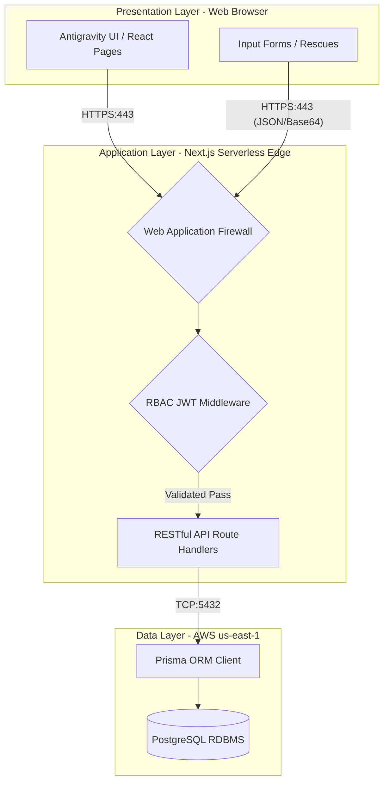
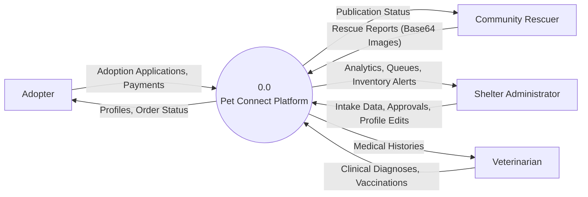
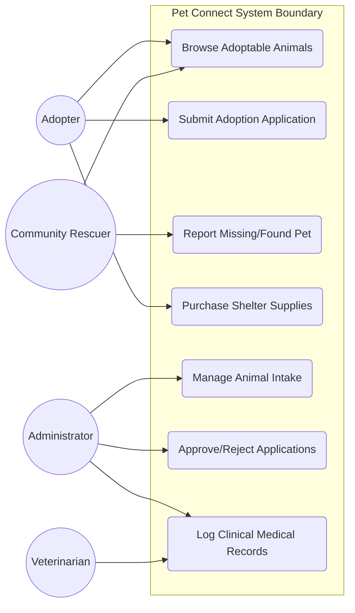
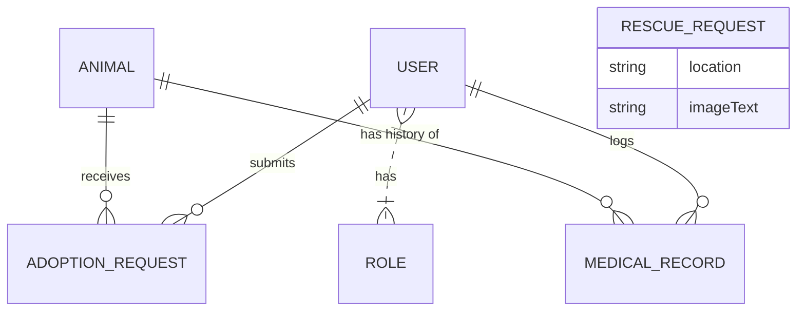
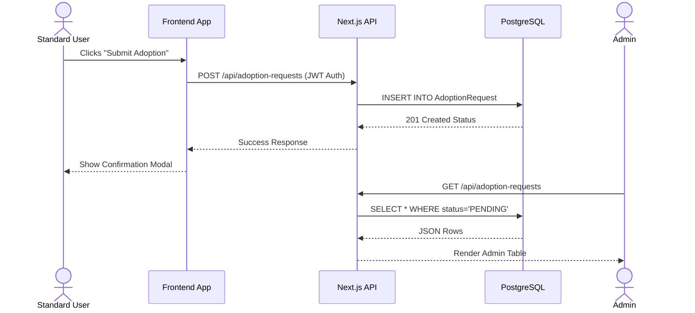
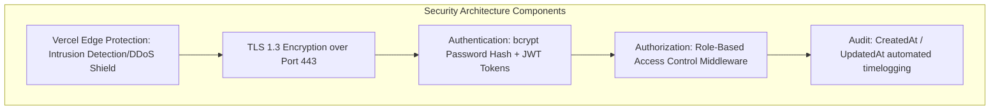
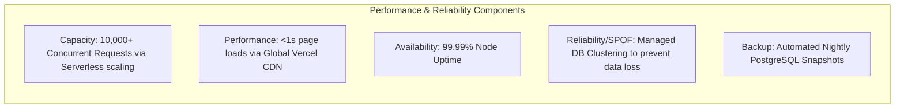

# 4. System Design

## 4.1. Users of the System
A user class is distinguished by the common responsibilities and interaction modes with the Pet Connect system. The system serves three primary user classes, distinguishing operational personnel from the external community:

1.  **Administrators (Shelter Staff)**: Operational data entry personnel and system operators responsible for the core management of the shelter. They manage animal intake workflows, review adoption requests, process community rescue reports, manage marketplace inventory, and define RBAC levels.
    *   *Anticipated Total Users*: 20
    *   *Max Concurrent Users*: 5
    *   *External Users*: 0 (Internal operational staff only)
2.  **Veterinarians**: Specialized operational support personnel. Their role is strictly isolated to clinical data entry requiring medical skill levels. They log diagnoses, treatments, and vaccinations linked to individual animal profiles.
    *   *Anticipated Total Users*: 10
    *   *Max Concurrent Users*: 3
    *   *External Users*: 0 (Internal/Contracted staff)
3.  **Standard Users (The General Public)**: External users accessing the public front-end. They browse adoptable animals, submit adoption applications, shop from the e-commerce marketplace, and dynamically supply structural data via reporting missing pets.
    *   *Anticipated Total Users*: 5,000+
    *   *Max Concurrent Users*: 100+
    *   *External Users*: 100% (External community)

## 4.2. System Architecture
The top-most level responsibility of Pet Connect is to digitize animal shelter workflows and securely broadcast adoptable inventory to the public. 

The system architecture was decomposed into a centralized **Cloud-Native Full-Stack Next.js pattern**, utilizing a logical Presentation, Application, and Data layer mapping. This unified monorepo partitioning approach was chosen over a physically decoupled SPA (e.g., separate React and Express repositories) to heavily reduce deployment complexity, eliminate cross-origin request (CORS) overhead, and exploit Server-Side Rendering (SSR) for profound SEO benefits on public-facing adoption pages. 

The processing system is centralized. The higher-level components collaborate using a strict Controller-Service pattern: the Presentation UI passes RESTful payloads to Next.js API Handlers (Controllers), which delegate database mutation logic to underlying Serverless functions (Services), culminating in ORM transactions.

### Hardware Organization & Peripheral Devices
*   **Presentation & Application Servers**: Serverless Edge Network nodes (Vercel). *Function*: Geographically load-balanced routing and dynamic HTML generation.
*   **Data Server**: 1 Primary PostgreSQL Instance (Neon/AWS us-east-1). *Function*: Centralized RDBMS storage locking.
*   **Peripheral Devices / Firewalls**: AWS WAF (Web Application Firewall) sitting in front of the Vercel edge to mitigate DDoS. The Database firewall only permits inbound TCP connections from Vercel's trusted IP bands. All communication is bottlenecked through HTTPS (Port 443) externally and TCP (Port 5432) internally. 
*   **Resource Estimates**: 
    *   *Processor*: 2 vCPUs allocated per Serverless Function burst.
    *   *Memory*: 1024MB RAM allotted per concurrent edge execution.
    *   *Storage*: 50GB allocated block storage for relational text data; 500GB S3-equivalent Object Storage for Base64 image offloading. 

### Software Components (CSCIs & APIs)
*   **Presentation Layer CSCs**: React (v18), Tailwind CSS, Next.js App Router mapping.
*   **Application Layer CSCs**: Node.js runtime, internal RESTful API Routes (`/api/animals`, `/api/auth`), `bcrypt` for hashing.
*   **Data Layer CSCs**: PostgreSQL (v14+) Database Platform, Prisma (v5) ORM interface acting as the primary JNDI-equivalent binding.
*   **Information Stored**: Structured Beneficiary info (Adopter details), Claim data (Rescue Reports), Inventory (Animals, Products).

### 4.2.1. System Architecture Diagram

#### Cloud Architecture Diagram
This diagram maps the “to-be-production-system”, depicting the overall integrated hardware and software structure across the presentation, application, and data regions.

#### Level 0 DFD (Context Diagram)
This Context Diagram demonstrates how external entities interact with the primitive process level.

#### System Level Use-Case Diagram
Establishes the boundaries of the digital ecosystem and the goals attained by distinct stakeholder roles.

## 4.3. Input Design
Input into the Pet Connect system is processed via electronic data entry GUIs utilizing standard HTTP protocol mapping to high-level data flows.
*   **Input Interfaces/Screens**: Dedicated React components such as `New Intake Form`, `Rescue Report GUI`, and `Clinical Diagnosis Screen`.
*   **Data Element Definitions & Edits**:
    *   `email`: Requires strict alphanumeric regex validation, mandatory.
    *   `password`: Minimum 8 alphanumeric characters, mandatory.
    *   `animalId`: Selected via bounded system dropdowns to prevent manual edit bypassing of foreign keys.
    *   `Base64 Image`: Scanned from the file-picker optical prompt, limited to 5MB payloads.
*   **Restrictions**: Access to Admin forms (transaction-based processing inputs) is strictly restricted by JWT middleware.

## 4.4. Output Design
System outputs encompass dynamic data display GUIs and structural reports generated from query results.
*   **Report Name**: `Public Animal Roster`
    *   *Purpose & Primary Users*: Displays "Available" animal grids for Standard Users. Open to the public. Continual frequency. 
*   **Report Name**: `Pending Rescue Dashboard`
    *   *Purpose & Primary Users*: Tabular display screen showing incoming community reports requiring moderation. Primary Users: Administrators. Restricted access.
*   **Report Name**: `Medical History Timeline`
    *   *Purpose & Primary Users*: Visual chronology of clinical diagnoses. Primary Users: Veterinarians. Highly restricted security access.

## 4.5. User Interface Layout
*(The cohesive UI strategy is driven by our global CSS framework and standardized React Layout definitions.)*
The UI design language is characterized as **"Antigravity"**. It relies on high-whitespace, dark-mode accessible, distraction-free inline CSS popups aimed at mitigating cognitive load for shelter staff. It utilizes Tailwind CSS for globally standardized 12-column grid scaling across desktop and mobile form factors.

## 4.6. Database Design
The system utilizes PostgreSQL, managed programmatically via Prisma schema files handling standard CRUD capability data stores.

### 4.6.1. List of Entities and Attributes
| Entity | Attributes & Validation Rules | CRUD Maintenance |
| :--- | :--- | :--- |
| **User** | `id` (UUID), `email` (String, Unique), `password` (Hashed), `role` (Enum: ADMIN, VET, USER) | Full CRUD via Admin |
| **Animal** | `id` (UUID), `name` (String), `species` (String), `status` (Enum: AVAILABLE, ADOPTED) | Full CRUD via Admin |
| **AdoptionRequest** | `id` (UUID), `animalId` (UUID FK), `userId` (UUID FK), `status` (Enum) | Create (User), Update (Admin) |
| **MedicalRecord** | `id` (UUID), `animalId` (UUID FK), `diagnosis` (Text), `date` (DateTime) | Create (Vet), Read Various |
| **RescueRequest** | `id` (UUID), `location` (Text), `image` (Base64 Text), `status` (Enum) | Create (Public), Update (Admin)|
| **Product** | `id` (Int PK), `name` (String), `price` (Float), `stock` (Integer) | Full CRUD via Admin |

### 4.6.2. E R Diagram

### 4.6.3. Structure of Tables
*   `Animal` Table: `id` is primary key, indexed sequential access. `status` constrained by ENUM validator.
*   `MedicalRecord` Table: `animalId` foreign key index, forces cascading deletion if parent `Animal` is archived.
*   `User` Table: `email` contains unique tree-index preventing duplicate account creation.

### 4.6.4. Non-database Management System Files
*   **`prisma/seed.js`**: An offline initialization file utilized for temporary data input during deployment. Record structures represent Javascript Objects mapping to Prisma schemas. Volume is low (development seed data). Contains hardcoded User array structures.
*   **`update_donors.js`**: A sequential access batch file serving offline maintenance. Reads external local arrays and writes sequentially to the central database, triggering at variable/manual frequencies.

## 4.7. Detailed Design
The Detailed Design is organized by **Feature/Object** hierarchy, highlighting the programmatic sequence of interactions.

**Sequence Diagram: Digital Adoption Workflow Feature**
This defines the stimulus-response pairs between the user, frontend, API, and the database class objects.

## 4.8. Security Architecture
The security architecture uses layered application logic adhering strictly to modern threat mitigation providing adequate protection against vulnerabilities.

## 4.9. Performance
The architecture leverages an extremely lightweight presentation framework and serverless deployment targeting ultra-high availability.

## 4.10. System Integrity Controls
*   **Internal Security**: Route Handler Middleware programmatically restricts GET/POST/PUT mapping. If a Standard User attempts to update `role` payloads, the controller actively strips the non-permitted data fields prior to DB insertion.
*   **Application Audit Trails**: All SQL tables inherently possess `createdAt` and `updatedAt` DateTime hooks establishing a persistent, un-bypassable transaction date audit.
*   **Verification Processes**: Prisma ORM executes strict type-safe referential integrity checks during all insertions (e.g., rejecting an adoption request if `animalId` UUID does not match an existing record).
*   **Identifiable Auditing**: Transaction logs automatically tie the mutation logic to the `userId` decoded from the active encrypted JWT session token.
